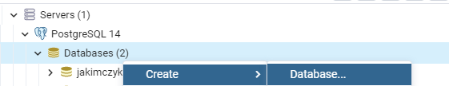
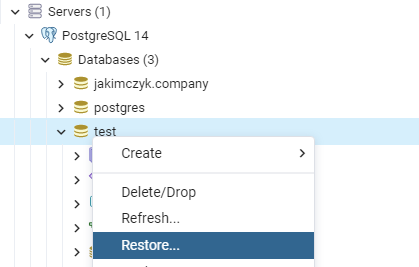

# About Employees management

It's CRUD application with graphical user interface, which helps user to manage their employees. It connects with
PostgreSQL database where data collection of employees are stored.

## User guide

Main window of a application has 4 options to choose:

1. List of Employees
2. Add a employee
3. Search and manage employee
4. Exit

### 1. List of employees

In this option you can look through your whole list of employees using two buttons: "previous" and "next".

### 2. Add employee

Here you are able to add a employee to database. You can choose between 3 options: "Manager", "Tradesman" and "Other job
title". First two are options, that have 2 extra informations to insert.

### 3. Search and manage employee

This point is used to search for particular employee with their pesel number. If employee is found, user is allowed to
delete this employee or update theirs informations.

### 4. Exit

This button is closing application.

## Technologies

Technologies used in this project:

- Java
- Swing
- PostgreSQL
- JDBC
- Lombok
- Maven

## How it works?

Main Java files are located in src/main/java/com.company

### Controller package

It contains all functions that doing functional things.

### DB package

In this package all database configuration and operation files are stored.

### Model package

This is package that contains all employees classes and class with ArrayList with is used to store employees objects .

### View package

Package with all Swing panels and frames, that create GUI.

## How to get started?

1. Download this project
2. You need to have PostgreSQL database and pgAdmin 4 application, to manage database.
3. In pgAdmin main window you have to create new database like this:
   
4. If you created a databe, right click on it and choose this option:
   
5. Now you need to choose "company.sql" file which is located in main package of this project and click "Restore"
6. After that your database is ready, now you have to change those values if needed:

```java
private static final String url="jdbc:postgresql://localhost:5432/jakimczyk.company";
private static final String user="postgres";
private static final String password="admin";
```

They are located in: src/main/java/com.company/DB/DataBaseConnection.java

```bash
src/main/java/com.company/DB/DataBaseConnection.java
```

7. Run application
